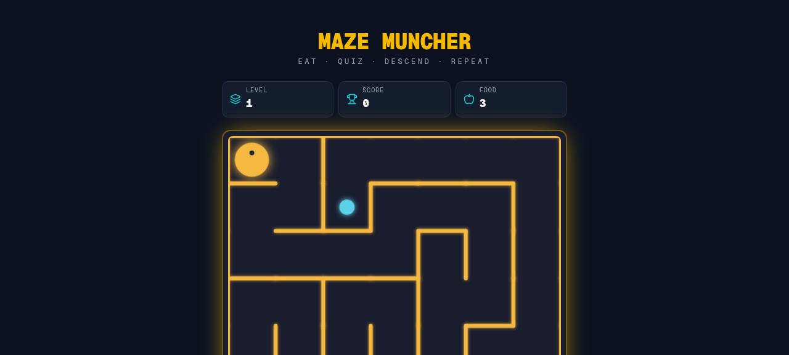
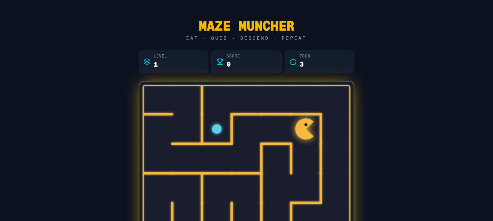

# 🎮 Maze Muncher Game

Maze Muncher is a browser-based maze adventure game built with **Next.js**, **TypeScript**, and **React**. Players navigate through procedurally generated mazes, collect pellets, answer quiz challenges, and race to complete levels while avoiding mistakes.

## ✨ Features

* 🧩 Procedurally generated mazes
* 🎯 Pellet collection gameplay
* ❓ Interactive quiz challenges
* 🎮 Keyboard and touch controls
* 📱 Mobile-friendly interface
* ⚡ Fast performance with Next.js
* 🎨 Modern UI design

## 📸 Screenshots

Add your game screenshots here:

| Gameplay                 | Quiz Challenge    |
| ------------------------ | ----------------- |
|  |  |

## 🚀 Getting Started

### Prerequisites

* Node.js 18+
* npm or pnpm

### Installation

Clone the repository:

```bash
git clone https://github.com/Afif-Ahmad-tech/Maze-Muncher-game.git
cd Maze-Muncher-game
```

Install dependencies:

```bash
npm install
```

Run the development server:

```bash
npm run dev
```

Open:

```text
http://localhost:3000
```

## 🛠️ Tech Stack

* Next.js
* React
* TypeScript
* Tailwind CSS
* Vercel

## 📂 Project Structure

```text
app/
components/
lib/
public/
package.json
next.config.mjs
```

## 🎯 Gameplay

1. Start the game.
2. Navigate through the maze.
3. Collect pellets and rewards.
4. Complete quiz challenges.
5. Reach the objective to finish the level.

## 🌐 Live Demo

Add your deployed game link here.

## 📜 License

This project is open source and available under the MIT License.

## 👨‍💻 Author

**Afif Ahmad**

GitHub: https://github.com/Afif-Ahmad-tech
